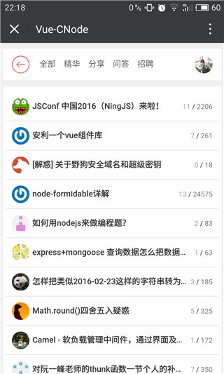
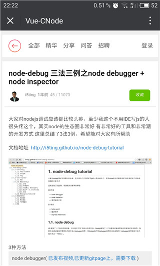
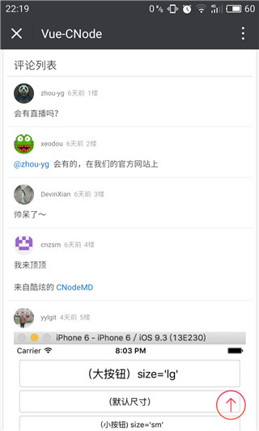
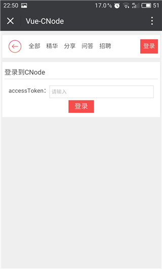
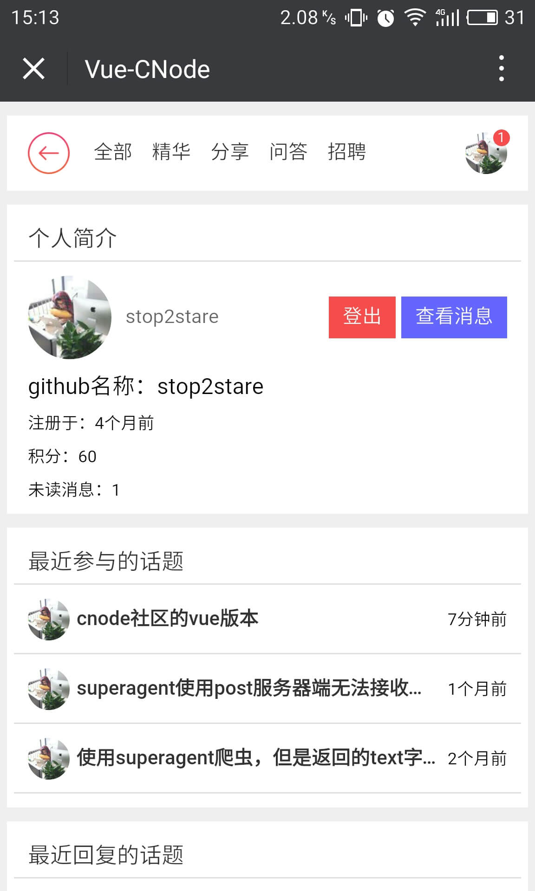

# cnode-vue

## 说明

这个项目就是用来练手`Vue`，`vue-router`，`Vuex`的。基本上就是把以前的一个[cnode-react](https://github.com/stop2stare/cnode-react/)项目移植到了`Vue`上面。然后用`webpack-dev-server`做了代理，放弃了用`Express`重新建立一个后台。

不过，这一次区别于[cnode-react](https://github.com/stop2stare/cnode-react/)，引入了类`Flux`的架构`Vuex`。

同时，也预计会根据 cnodejs.org 提供的API将整个功能都做完。

## 用法

确保已经全局安装了`Node.js`，`webpack-dev-server`，`webpack`。

``` sh
$ npm install
$ npm run start
```

然后页面会自动弹出来。

## 截图

* 帖子列表页



* 帖子详情页



* 帖子评论



* 登录页



* 他人详情页


* 自己详情页



* 消息页


## TODO

* 帖子评论
* 新建主题
* 评论点赞
* 点击未读消息可以直接跳到对应的锚点
* 用Electron打包应用

> 其实鉴于手机上对于markdown的支持，我就不想做新建主题了。